<div align="center">
<!-- HEADER -->

[](https://linkedin.com/in/ayush071)
[](https://www.imayush.dev)
[](https://x.com/ayushpandey_071)
[](https://instagram.com/lucidforu_)
[](https://buymeacoffee.com/ayushsdevforge) 
</div>


## 🚀 About Me
<table>
<tr>
<td width="60%">

```javascript
const ayush = {
    pronouns: "he" | "him",
    education: "B.Tech in CSE @ RGPV, Bhopal",

    placedAt: "System Engineer (Digital Cadre) @ TCS",
    role: "Full Stack Developer",

    currentFocus: "Building scalable applications while venturing into AI",
    hobbies: ["🏔️ Trekking", "🚗 Hitchhiking", "✈️ Adventures"]
};
```

</td>
<td width="40%" align="center">

</td>
</tr>
</table>

> *"Passionate about innovation, problem-solving, and building impactful solutions that bridge technical development with real business needs."*

---


## 🛠️ Tech Arsenal

<table>
<tr>
<td width="50%" valign="top">

### 💻 Frontend


### ⚙️ Backend


</td>
<td width="50%" valign="top">

### 🧠 CS Fundamentals


### 🔧 Languages & Tools


</td>
</tr>
</table>


<div align="center">


<br>


> *It's not who I am underneath, but what I do that defines me.*

</div>
